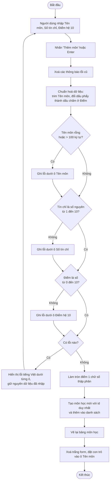

# F1. Thêm môn học

```mermaid
flowchart TD
    A([Bắt đầu]) --> B[Người dùng nhập Tên môn, Số tín chỉ, Điểm hệ 10]
    B --> C[Nhấn 'Thêm môn' hoặc Enter]
    C --> D[Xoá các thông báo lỗi cũ]
    D --> E[Chuẩn hoá dữ liệu:<br/>trim Tên môn, đổi dấu phẩy thành dấu chấm ở Điểm]
    E --> V1{Tên môn rỗng<br/>hoặc > 100 ký tự?}
    V1 -- Có --> X1[Ghi lỗi dưới ô Tên môn]
    V1 -- Không --> V2
    X1 --> V2{Tín chỉ là số nguyên<br/>từ 1 đến 10?}
    V2 -- Không --> X2[Ghi lỗi dưới ô Số tín chỉ]
    V2 -- Có --> V3
    X2 --> V3{Điểm là số<br/>từ 0 đến 10?}
    V3 -- Không --> X3[Ghi lỗi dưới ô Điểm hệ 10]
    V3 -- Có --> K
    X3 --> K{Có lỗi nào?}
    K -- Có --> L[Hiển thị lỗi tiếng Việt dưới từng ô,<br/>giữ nguyên dữ liệu đã nhập]
    L --> B
    K -- Không --> M[Làm tròn điểm 1 chữ số thập phân]
    M --> N[Tạo môn học mới với id duy nhất<br/>và thêm vào danh sách]
    N --> O[Vẽ lại bảng môn học]
    O --> P[Xoá trắng form, đặt con trỏ vào ô Tên môn]
    P --> Z([Kết thúc])
```
