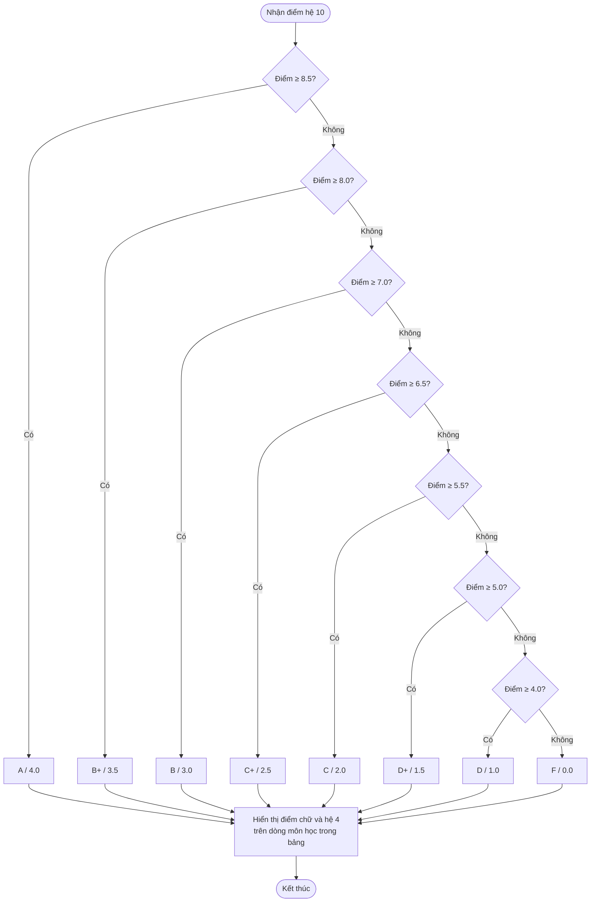

# F2. Quy đổi điểm

Đầu vào: điểm hệ 10 đã làm tròn 1 chữ số thập phân. Đầu ra: điểm chữ và điểm hệ 4.

```mermaid
flowchart TD
    A([Nhận điểm hệ 10]) --> B{Điểm ≥ 8.5?}
    B -- Có --> RA[A / 4.0]
    B -- Không --> C{Điểm ≥ 8.0?}
    C -- Có --> RBp[B+ / 3.5]
    C -- Không --> D{Điểm ≥ 7.0?}
    D -- Có --> RB[B / 3.0]
    D -- Không --> E{Điểm ≥ 6.5?}
    E -- Có --> RCp[C+ / 2.5]
    E -- Không --> F{Điểm ≥ 5.5?}
    F -- Có --> RC[C / 2.0]
    F -- Không --> G{Điểm ≥ 5.0?}
    G -- Có --> RDp[D+ / 1.5]
    G -- Không --> H{Điểm ≥ 4.0?}
    H -- Có --> RD[D / 1.0]
    H -- Không --> RF[F / 0.0]
    RA & RBp & RB & RCp & RC & RDp & RD & RF --> Z[Hiển thị điểm chữ và hệ 4<br/>trên dòng môn học trong bảng]
    Z --> E1([Kết thúc])
```
