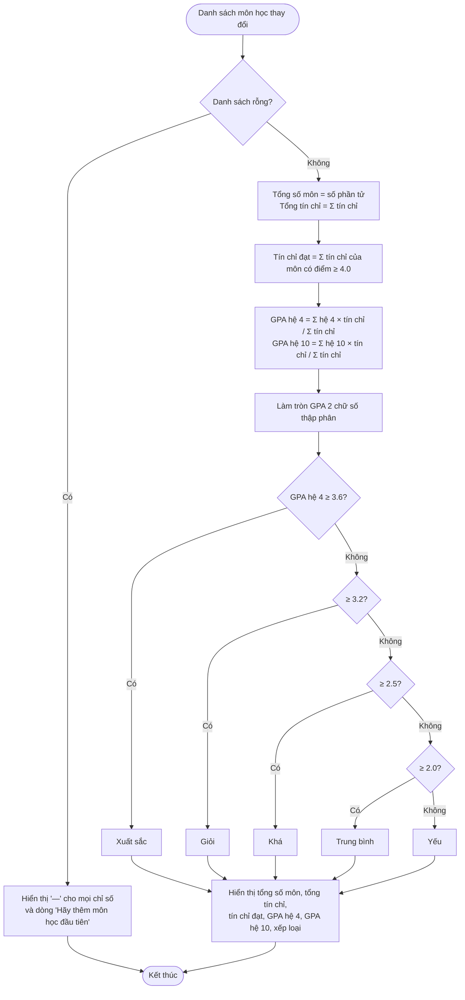

# F3. Tính GPA và xếp loại

Chạy lại mỗi khi danh sách môn học thay đổi (thêm, sửa, xoá, tải trang).

```mermaid
flowchart TD
    A([Danh sách môn học thay đổi]) --> B{Danh sách rỗng?}
    B -- Có --> C[Hiển thị '—' cho mọi chỉ số<br/>và dòng 'Hãy thêm môn học đầu tiên']
    C --> Z([Kết thúc])
    B -- Không --> D[Tổng số môn = số phần tử<br/>Tổng tín chỉ = Σ tín chỉ]
    D --> E[Tín chỉ đạt = Σ tín chỉ của môn có điểm ≥ 4.0]
    E --> F[GPA hệ 4 = Σ hệ 4 × tín chỉ / Σ tín chỉ<br/>GPA hệ 10 = Σ hệ 10 × tín chỉ / Σ tín chỉ]
    F --> G[Làm tròn GPA 2 chữ số thập phân]
    G --> H{GPA hệ 4 ≥ 3.6?}
    H -- Có --> X1[Xuất sắc]
    H -- Không --> I{≥ 3.2?}
    I -- Có --> X2[Giỏi]
    I -- Không --> J{≥ 2.5?}
    J -- Có --> X3[Khá]
    J -- Không --> K{≥ 2.0?}
    K -- Có --> X4[Trung bình]
    K -- Không --> X5[Yếu]
    X1 & X2 & X3 & X4 & X5 --> L[Hiển thị tổng số môn, tổng tín chỉ,<br/>tín chỉ đạt, GPA hệ 4, GPA hệ 10, xếp loại]
    L --> Z
```
