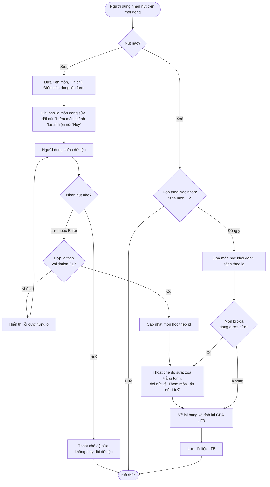

# F4. Sửa và xoá môn học

```mermaid
flowchart TD
    A([Người dùng nhấn nút trên một dòng]) --> B{Nút nào?}

    B -- Sửa --> S1[Đưa Tên môn, Tín chỉ, Điểm của dòng lên form]
    S1 --> S2[Ghi nhớ id môn đang sửa,<br/>đổi nút 'Thêm môn' thành 'Lưu', hiện nút 'Huỷ']
    S2 --> S3[Người dùng chỉnh dữ liệu]
    S3 --> SC{Nhấn nút nào?}
    SC -- Huỷ --> S8[Thoát chế độ sửa,<br/>không thay đổi dữ liệu]
    S8 --> Z
    SC -- Lưu hoặc Enter --> S4{Hợp lệ theo<br/>validation F1?}
    S4 -- Không --> S5[Hiển thị lỗi dưới từng ô]
    S5 --> S3
    S4 -- Có --> S6[Cập nhật môn học theo id]
    S6 --> S7[Thoát chế độ sửa: xoá trắng form,<br/>đổi nút về 'Thêm môn', ẩn nút 'Huỷ']
    S7 --> R

    B -- Xoá --> D1{Hộp thoại xác nhận:<br/>'Xoá môn ...?'}
    D1 -- Huỷ --> Z([Kết thúc])
    D1 -- Đồng ý --> D2[Xoá môn học khỏi danh sách theo id]
    D2 --> D3{Môn bị xoá<br/>đang được sửa?}
    D3 -- Có --> S7
    D3 -- Không --> R

    R[Vẽ lại bảng và tính lại GPA - F3] --> P[Lưu dữ liệu - F5]
    P --> Z
```
