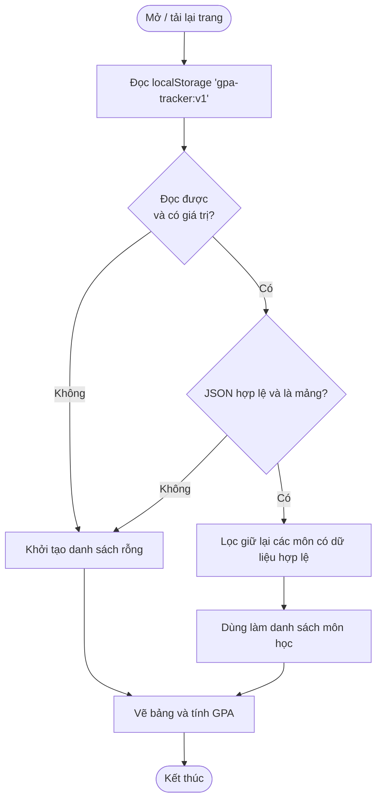
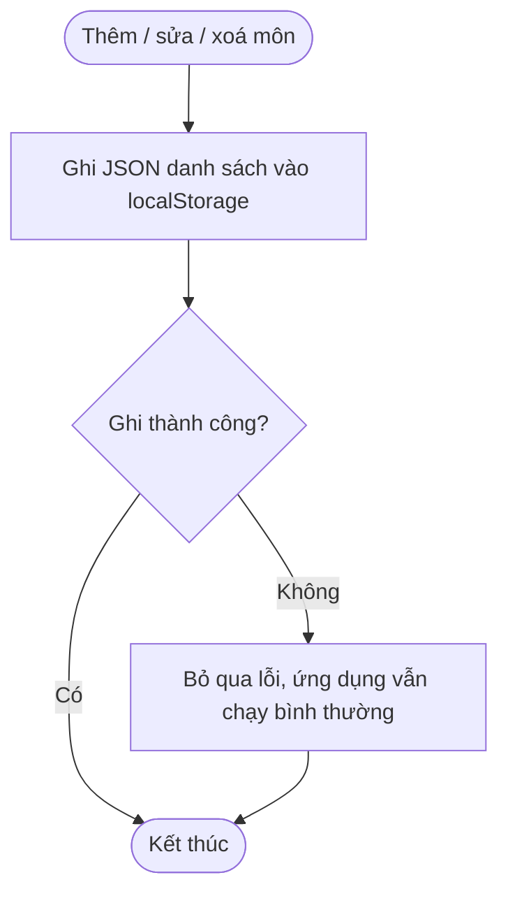
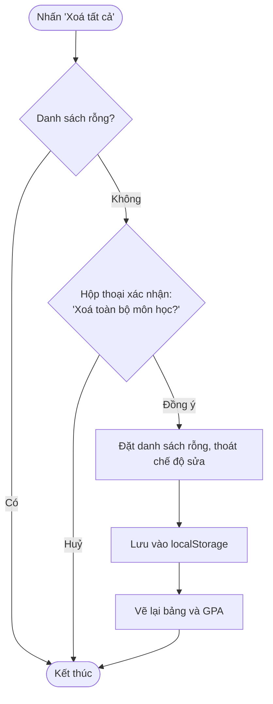

# F5. Lưu dữ liệu

Key localStorage: `gpa-tracker:v1`.

## Tải dữ liệu khi mở trang

```mermaid
flowchart TD
    A([Mở / tải lại trang]) --> B[Đọc localStorage 'gpa-tracker:v1']
    B --> C{Đọc được<br/>và có giá trị?}
    C -- Không --> E[Khởi tạo danh sách rỗng]
    C -- Có --> D{JSON hợp lệ và là mảng?}
    D -- Không --> E
    D -- Có --> F[Lọc giữ lại các môn có dữ liệu hợp lệ]
    F --> G[Dùng làm danh sách môn học]
    E --> H[Vẽ bảng và tính GPA]
    G --> H
    H --> Z([Kết thúc])
```

## Lưu khi có thay đổi

```mermaid
flowchart TD
    A([Thêm / sửa / xoá môn]) --> B[Ghi JSON danh sách vào localStorage]
    B --> C{Ghi thành công?}
    C -- Có --> Z([Kết thúc])
    C -- Không --> D[Bỏ qua lỗi, ứng dụng vẫn chạy bình thường]
    D --> Z
```

## Xoá tất cả

```mermaid
flowchart TD
    A([Nhấn 'Xoá tất cả']) --> B{Danh sách rỗng?}
    B -- Có --> Z([Kết thúc])
    B -- Không --> C{Hộp thoại xác nhận:<br/>'Xoá toàn bộ môn học?'}
    C -- Huỷ --> Z
    C -- Đồng ý --> D[Đặt danh sách rỗng, thoát chế độ sửa]
    D --> E[Lưu vào localStorage]
    E --> F[Vẽ lại bảng và GPA]
    F --> Z
```
